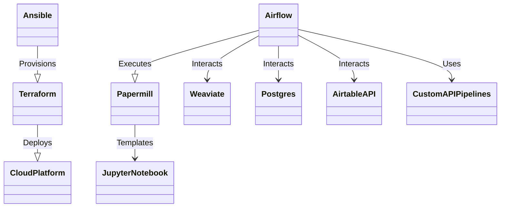

### Building a Modular and Scalable Video Processing System Using IaC

#### **1. Ansible: Role Definition and Playbook Design**

Start your Infrastructure as Code (IaC) journey by setting up the foundational structure with **Ansible**. Here, you'll define roles for each critical component of your system. These roles include the databases, indexing systems, processing engines, and more. Once these roles are clearly outlined:

- Design playbooks for each role. These playbooks act as scripts, ensuring that each role is provisioned and configured uniformly across deployments.
  
#### **2. Terraform: Platform Provisioning and Domain Setup**

Transition into cloud infrastructure provisioning using **Terraform**. This tool lets you define infrastructure components as code, ensuring scalability and reproducibility. Key steps include:

- Define cloud resources: compute instances, storage buckets, and networking components.
- Set up your domain ingress, pointing to "https://Cdaprod.dev", ensuring that your applications and services are accessible.

#### **3. Airflow: Orchestrating the Workflows**

With infrastructure in place, focus on task orchestration using **Airflow**. Here, you'll design Directed Acyclic Graphs (DAGs) to represent your system's workflows. Each task in the DAG can correspond to a Papermill notebook execution, data processing, or interaction with databases.

- Set up the Airflow master node to oversee task scheduling and monitoring.
- Configure worker nodes that will carry out the tasks. These nodes will integrate with various systems like Weaviate, Postgres, Airtable API, and custom API pipelines.

#### **4. Papermill: Templating Notebooks for Dynamic Execution**

**Papermill** forms the core of your data processing tasks. Using this tool, you'll:

- Set up notebook execution mechanisms.
- Design pipelines that use Jupyter notebooks as templates.
- Parameterize notebooks for dynamic input, ensuring flexibility. For instance, notebooks for BabyAGI+tools, QA conversational vector retrieval, and Streamlit front-end apps.

#### **Connecting Integrations**

Your system's power lies in its ability to interact with various services seamlessly:

- **Weaviate client**: Ensure semantic search and indexing capabilities.
- **Supabase Postgres**: Offer structured data storage and powerful querying.
- **Airtable API**: Allow for a flexible database with API access.
- **Custom API Pipelines**: Design endpoints tailored to specific tasks, such as video processing or social media interactions.

#### **Sample Deployments**

To visualize the potential of this setup, consider these sample projects:

- **Video Archive and Metadata Web Service**: This would use the infrastructure to ingest videos, index them without moving the original files, and generate associated metadata.
  
- **Social Media Automation Pipeline App**: Here, the focus would shift to social media. Pipelines, represented by notebooks, would interact with social media platforms through custom API endpoints.

---



This visual representation underscores the relationships and interactions between various system components, highlighting the modular and interconnected nature of the setup.


## Infrastructure as Code (IaC) Development Guide

### **1. Ansible: Role Definition and Playbook Design**

#### Instructions:

1. Navigate to the `ansible` directory from the root of the project.
   
2. Within the `roles` directory, create separate directories for each role. For instance:
   ```
   roles/
       weaviate/
       postgres/
       airflow_master/
       airflow_worker/
       papermill/
       ...
   ```

3. For each role directory:
   - Create a `tasks` folder and within it, an `main.yml` file. This will hold the actual commands for setting up that role.
   - If necessary, add a `files` or `templates` directory to hold configuration files or templates for that role.

4. Back in the main `ansible` directory, create a `playbook.yml` that will define the order in which these roles should be run and on which hosts.

---

### **2. Terraform: Platform Provisioning and Domain Setup**

#### Instructions:

1. Navigate to the `terraform` directory from the root.

2. Start by defining your cloud provider credentials and settings in a `provider.tf` file.

3. For each cloud resource (e.g., compute instances, storage, networking), create a separate `.tf` file. For instance:
   ```
   compute_instance.tf
   storage_bucket.tf
   networking.tf
   ```

4. Define your domain ingress settings in a `domain.tf` file to set up "https://Cdaprod.dev".

5. Ensure all sensitive information, like API keys, is stored in a `variables.tf` file and kept secure.

---

### **3. Airflow: Orchestrating the Workflows**

#### Instructions:

1. Navigate to the `airflow` directory.

2. Within `dags`, create individual Directed Acyclic Graph (DAG) definitions as `.py` files. Each DAG will represent a workflow in your system.

3. Set up a `plugins` directory. Here, you'll define any custom operators or plugins for Airflow to interact with systems like Weaviate, Postgres, or custom APIs.

---

### **4. Papermill: Templating Notebooks for Dynamic Execution**

#### Instructions:

1. Navigate to the `papermill` directory.

2. Create a `notebooks` directory to store all your Jupyter notebooks.

3. In the root of `papermill`, set up a `pipeline.py` that will handle the dynamic execution of these notebooks based on parameters. This script should call Papermill's API to execute the notebooks.

---

### **Connecting Integrations**

#### Instructions:

1. Each integration, be it Weaviate, Postgres, Airtable API, or custom API, should have its own directory under a `integrations` folder at the root.

2. Inside each integration directory:
   - Create a `client.py` to handle interactions with that service.
   - If necessary, add a `config.yml` to store any configuration details or endpoints.

---

### **Sample Deployments**

#### Instructions:

1. Navigate to a `samples` directory at the root.

2. Create separate directories for each sample project, like `video_archive` and `social_media_automation`.

3. Within each sample project directory, structure your code based on its functionality. For instance, the `video_archive` could have subdirectories like `ingestion`, `indexing`, and `metadata_generation`.

---

Remember to regularly commit your changes to version control to ensure that progress is saved and can be collaborated on with other team members.


## Detailed Infrastructure as Code (IaC) Development Guide

### **1. Ansible: Role Definition and Playbook Design**

#### Instructions:

1. **Setup Ansible Directory Structure**: 
   - Navigate to the `ansible` directory from the root of the project.
   - Set up the default directory structure using the `ansible-galaxy init` command.

2. **Role Creation**:
   - Within the `roles` directory, create separate directories for each role. For instance:
     ```
     roles/
         weaviate/
         postgres/
         airflow_master/
         airflow_worker/
         papermill/
         ...
     ```

3. **Role Configuration**:
   - For each role:
     - `tasks/main.yml`: Holds the actual tasks for setting up that role.
     - `handlers/main.yml`: Contains handlers, which may be used by this role or even anywhere outside this role.
     - `templates/`: Holds template files which will be deployed by this role.
     - `files/`: Contains files that will be deployed by this role.
     - `vars/main.yml`: Variables for the roles.
     - `defaults/main.yml`: Default lower-priority variables for this role.

4. **Playbook Configuration**:
   - Create a `playbook.yml` in the `ansible` directory. This will define which roles should be run and on which hosts. Also, specify any role-specific variables or tasks.

---

### **2. Terraform: Platform Provisioning and Domain Setup**

#### Instructions:

1. **Initialize Terraform**:
   - Navigate to the `terraform` directory from the root.
   - Initialize Terraform with `terraform init`.

2. **Cloud Provider Configuration**:
   - Define your cloud provider in a `provider.tf` file. This specifies the provider and access details.

3. **Resource Configuration**:
   - For each cloud resource, create a separate `.tf` file.
   - Always begin with the networking resources. Define VPC, subnets, and security groups.
   - Next, focus on compute resources like EC2 instances or Kubernetes clusters.
   - Lastly, define storage and other auxiliary resources.

4. **Domain Configuration**:
   - Create a `dns.tf` file to handle your domain setup and DNS configurations for "https://Cdaprod.dev".

5. **Variable Management**:
   - Use `variables.tf` to define variables.
   - `outputs.tf` should be used to define outputs from your modules.

---

### **3. Airflow: Orchestrating the Workflows**

#### Instructions:

1. **Airflow Base Setup**:
   - Navigate to the `airflow` directory.
   - Setup the basic directory structure with `dags/`, `plugins/`, and `logs/`.

2. **DAG Configuration**:
   - Within `dags`, create `.py` files for each Directed Acyclic Graph (DAG) definition. Each DAG represents a workflow.
   - Use the Python Operator to call functions defined elsewhere in your codebase.

3. **Plugin Management**:
   - In the `plugins` directory, define custom operators, hooks, or sensors for Airflow. 
   - This is where integration with systems like Weaviate, Postgres, or custom APIs should be defined.

---

### **4. Papermill: Templating Notebooks for Dynamic Execution**

#### Instructions:

1. **Setup Papermill**:
   - Navigate to the `papermill` directory.
   - Ensure you have `papermill` installed.

2. **Notebook Storage**:
   - Create a `notebooks/` directory. This stores all original Jupyter notebooks.

3. **Dynamic Execution**:
   - Write a Python script, say `execute_notebooks.py`, to handle dynamic execution. Use Papermill's API to inject parameters into notebooks and execute them.

---

### **5. Integration Framework**

#### Instructions:

1. **Directory Structure**:
   - At the root, create an `integrations/` directory.
   - For each integration (Weaviate, Postgres, etc.), create a sub-directory.

2. **Client Creation**:
   - Inside each integration directory, write a `client.py`. This Python script/class should offer methods to interact with that specific service.

---

### **Sample Projects**

1. **Directory Creation**:
   - Navigate to a `samples/` directory at the root.
   - Make separate directories for each sample project.

2. **Project Structure**:
   - For instance, inside `video_archive/`, you could have:
     - `ingestion/`: Scripts and resources for ingesting videos.
     - `indexing/`: Code to index the videos.
     - `metadata_generation/`: Scripts to generate and store metadata.

---

### **Best Practices**:
- Use Git for version control. Regularly commit and push your changes.
- Write clear, commented code.
- Always test your code in a staging environment before deploying to production.