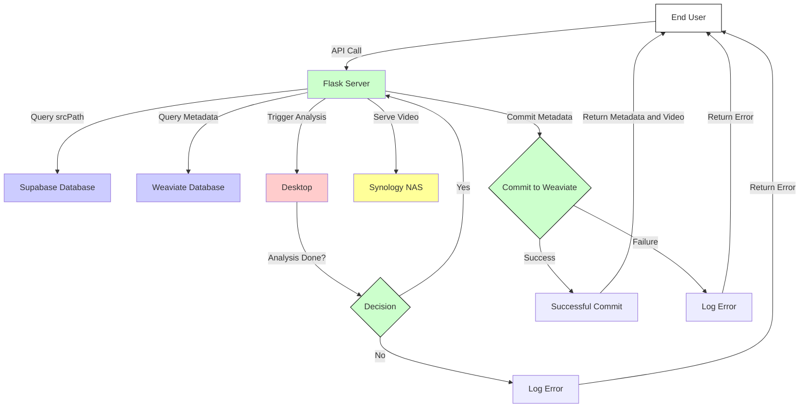

# Index-Videos

## Got loose videos somewhere? Find them!

### Index a drive from anywhere… from the command-line to the cloud!!


## What Does This Do?

This toolkit provides a comprehensive guide and codebase for indexing videos from any storage location, be it your local machine or the cloud. It extracts essential metadata and even frame data for AI analysis. All this data can be stored in a Supabase database and then used for vectorized querying through Weaviate.

---

## How Does It Work?



1. **Indexing**: Scans through directories to find video files and extracts essential metadata.
2. **FrameExtraction**: Captures frames from the video files for further analysis.
3. **Supabase**: Holds the metadata and frame data in a structured database.
4. **Weaviate**: Allows for vectorized querying of this complex data.
5. **User**: Can access and query this rich dataset.

---

Certainly! Below is a full-length README.md for your repository named `cda.Index-Videos`. This README includes sections on the project's purpose, how to set it up, how to use it, and other important details.

---

# cda.Index-Videos

## Overview
`cda.Index-Videos` is a comprehensive video analysis and metadata management system. It aims to facilitate the extraction, indexing, and storage of structural and semantic metadata from video files. This project integrates various machine learning models and databases to provide an end-to-end solution for video content management.

## Features
- Structural Metadata Extraction
- Keyframe Extraction
- ResNet-50 and GPT-3 Embeddings
- Metadata Indexing in Weaviate and Postgres
- Data Lifecycle Management using Pandas DataFrame
- Scalable and Secure
- Comprehensive Task Management

## Technologies Used
- Python
- OpenCV
- TensorFlow
- Pandas
- Weaviate
- PostgreSQL
- Flask

## Prerequisites
- Python 3.x
- pip
- Virtual environment (optional but recommended)

## Installation

1. Clone the repository:
    ```bash
    git clone https://github.com/Cdaprod/cda.Index-Videos.git
    ```

2. Navigate to the project directory:
    ```bash
    cd cda.Index-Videos
    ```

3. Create a virtual environment (optional):
    ```bash
    python3 -m venv venv
    ```

4. Activate the virtual environment:
    - **Linux/MacOS**: `source venv/bin/activate`
    - **Windows**: `venv\Scripts\activate`

5. Install dependencies:
    ```bash
    pip install -r requirements.txt
    ```

## Usage

### Local Setup
1. Run the Flask server:
    ```bash
    flask run
    ```

2. Open the Jupyter Notebook `VideoAnalysisClientNotebook.ipynb` to interact with the system.

### API Calls
- Metadata extraction and indexing:
    ```
    POST /extract-metadata
    ```

- Keyframe extraction:
    ```
    POST /extract-keyframes
    ```

- ... (Add more API routes and their descriptions)

## Documentation
Refer to the `docs/` folder for detailed documentation on each component, API endpoint, and other technical details.

## Task Management
We follow a systematic approach to task management using a `TaskCreationChain` class. Refer to `task_management.py` for the implementation.

## Contributing
Please read the CONTRIBUTING.md for guidelines on how to contribute to this project.

## License
This project is licensed under the MIT License. See the `LICENSE.md` file for details.

## Contact
- **David Cannan**
    - [GitHub](https://github.com/Cdaprod)
    - [Twitter](https://twitter.com/cdasmktcda)
    - [LinkedIn](https://www.linkedin.com/in/cdasmkt/)
    - [Blog](https://sanity.cdaprod.dev)

## Acknowledgements
Special thanks to OpenAI, the TensorFlow team, and all open-source contributors who made this project possible.

---

Feel free to add or remove sections as you see fit. This README aims to provide a comprehensive guide to your project.
---

## How to Contribute

1. Fork the repository.
2. Create a new branch for your feature or fix.
3. Commit your changes.
4. Open a pull request.

---

## Special Note

Refactoring life's data into a structured schema opens up a world of possibilities. From video and image content to client and target marketing data, it all comes together with a vector database like Weaviate. The high point is AI agents using this as a toolkit, making this not just a project, but a significant asset in data management and AI.